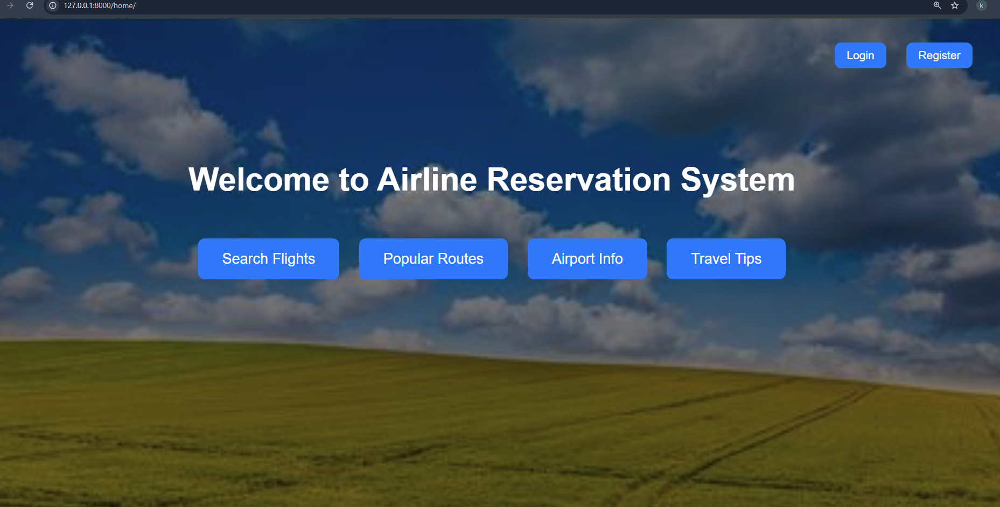
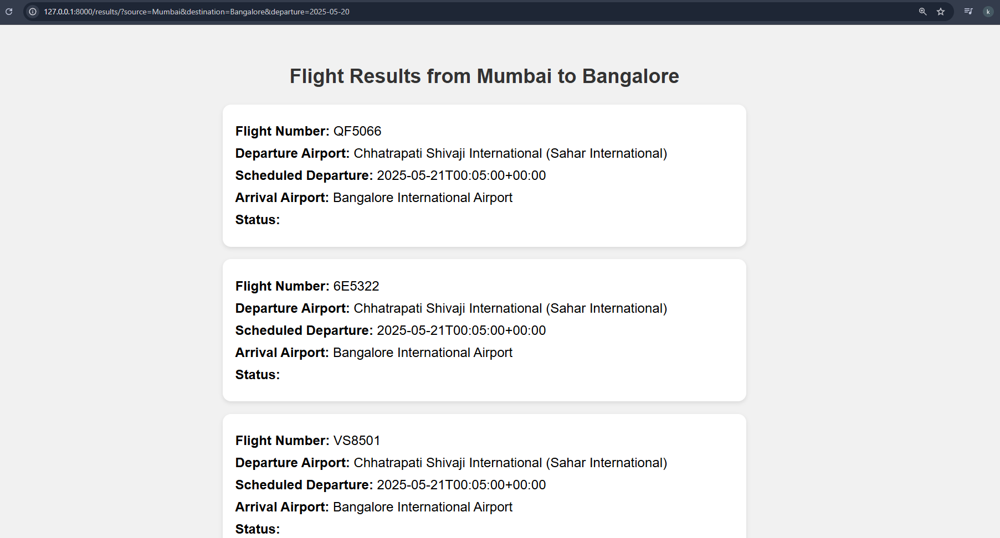
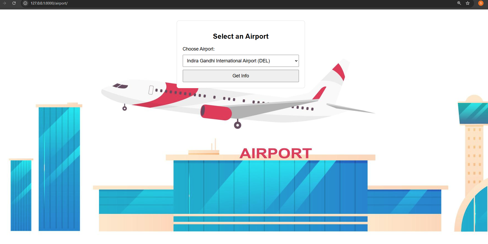
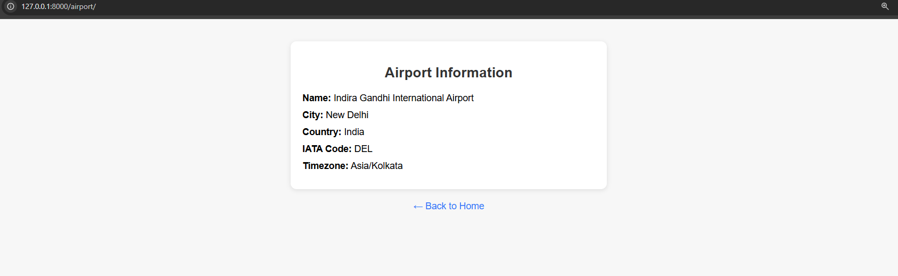
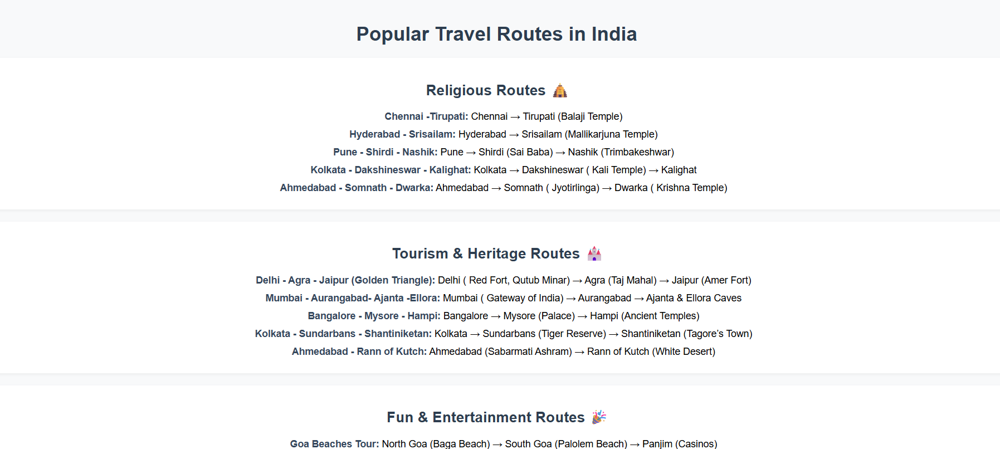
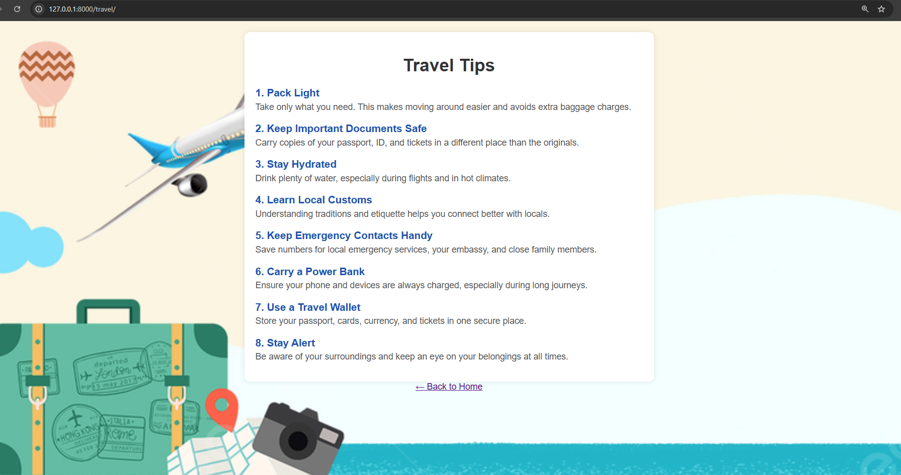

# ✈️ Airline Reservation System (Django Project)

A web-based airline reservation system built using **Django**, **Python**, **HTML/CSS**, and **MySQL**. The project fetches live flight data via the AviationStack API and provides useful features for flight search, airport info, travel routes, and travel tips.

---

## 📁 Project Structure

FINALPROJ/
├── .venv/                      # Virtual environment (auto-generated)
│   ├── Include/
│   ├── Lib/
│   ├── Scripts/
│   ├── .gitignore
│   └── pyvenv.cfg
│
├── finalproj/                 # Main Django project folder
│   └── ... (settings.py, urls.py etc.)
│
├── myapp/                     # Django app
│   ├── __pycache__/
│   ├── migrations/
│   ├── static/
│   │   └── images/
│   │       ├── airport.jpeg
│   │       ├── home.jpeg
│   │       ├── search_form.jpg
│   │       └── travel.jpeg
│   │
│   ├── templates/
│   │   └── myapp/
│   │       ├── home.html
│   │       ├── flights.html
│   │       ├── results.html
│   │       ├── popular_routes.html
│   │       ├── airport_info.html
│   │       ├── airport_result.html
│   │       └── travel_tip.html
│   │
│   ├── __init__.py
│   ├── admin.py
│   ├── apps.py
│   ├── models.py
│   ├── tests.py
│   ├── urls.py
│   ├── utils.py
│   └── views.py
│
├── .env.txt                   # 🔴 Rename to .env (to store secrets like API keys)
├── db.sqlite3                 # SQLite database
├── manage.py                  # Django command-line tool
└── requirements.txt           # List of installed packages
|__ README.md                  #  Setup and documentation

---

## 🚀 Features

- 🔎 **Live Flight Search** using AviationStack API  
- 🧭 **Popular Travel Routes** in India  
- 🛫 **Airport Info Lookup** via MySQL database  
- 🧳 **Travel Tips Page** for users  
- 🖼️ Integrated with relevant images for better UI

---

## 🔧 Setup Instructions

### 1. Clone the project
```bash
git clone <your-repo-url>
cd FINALPROJ

2. Create virtual environment
bash
Copy
Edit
python -m venv .venv
3. Activate virtual environment
On Windows:

bash
Copy
Edit
.venv\Scripts\activate
On Linux/Mac:

bash
Copy
Edit
source .venv/bin/activate
4. Install dependencies
bash
Copy
Edit
pip install -r requirements.txt
5. Add your AviationStack API key
Rename .env.txt to .env

Inside .env, add:

ini
Copy
Edit
AVIATION_API_KEY=your_api_key_here
6. Apply migrations and run server
bash
Copy
Edit
python manage.py migrate
python manage.py runserver
Open browser at: http://127.0.0.1:8000/


🖼️ Screenshots
🏠 Home Page


✈️ Search Flights


✈️ Search Flights results


📍 Airport Info


📍 Airport Info result


📌 Popular Routes


📝 Travel Tips


---

📦 Tech Stack
Backend: Django (Python)
Frontend: HTML, CSS
Database:  MySQL
API: AviationStack API

---

🙋‍♀️ Author
👩‍💻 Project by Shruti 
📚 Student Developer | Django Enthusiast

---

⚠️ Notes
🔐 Keep your .env file secret – never share your real API key!

---

✅ Tested with Django 4.x and Python 3.x

---

